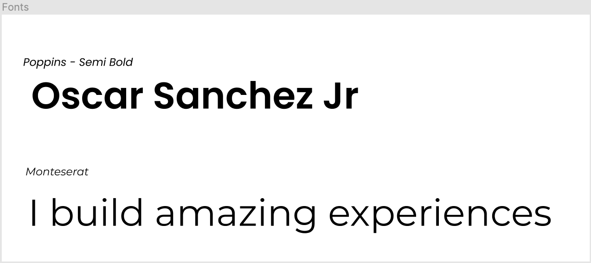

# HeyOSJ

I have been working on my CSS lately and figured it might be a good time to redo my portfolio to show off my new React project I've been working on. I liked the design of my last portfolio but felt it was a bit busy and responsiveness needed major improvement.

# The Design

### Layout

I went for a mobile first approach, which admitedly was new for me. After trying it out, I understand the value in it. I will continue this practice.

### Colors

I wanted to use the same colors that were in my svgs. Most importantly I did not want to go with a strictly white background or strictly black so I went for colors that were a bit warm and flat.

### Typography

For fonts I chose two that I really liked. For all the titles I went with Poppins, and everything else I went with Montserrat.

### SVGs

I built these SVGs with Affinity Designer, this was my first time building anything with this type of software but it was pretty fun creating these thing.

The favicon and logo

Myself

My Desk

## Code

### Languages Used

-   HTML
-   CSS
-   JavaScript

### Externals

-   Font Awesome for icons
-   Google Fonts

### CSS

I wanted to work on specificity, turned out to be a lot more writing than intened but did nice readable look.

I also went with variables as can be seen here.

### JS

The bulk of the JavaScript is being used here to pull my GitHub repos to searve in the additional projects area. The thought behind this was that as I create more repos the portfolio would update itself.

### Performance

I ran several lighthouse audits to see which areas could use improvements. Here is when I realized the importance in Accessibilty (which the red in my svgs don't help much so expect an improvement to come for that) as well as minifying my CSS code.

##### Thanks for taking the time to read this!
